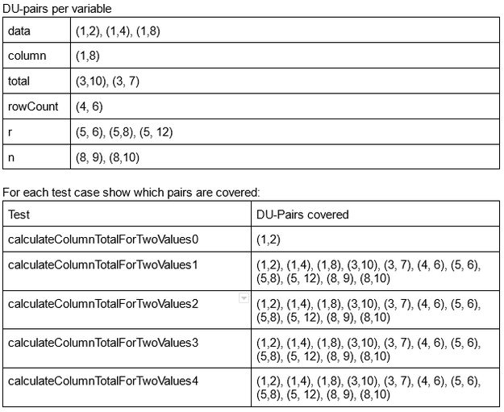

**SENG 438 - Software Testing, Reliability, and Quality**

**Lab. Report #3 – Code Coverage, Adequacy Criteria and Test Case Correlation**

| Group \#:      |     |
| -------------- | --- |
| Student Names: |     |
| Muhammad Tariq |     |
| Vrund Patel    |     |
| Anand Patel    |     |

(Note that some labs require individual reports while others require one report
for each group. Please see each lab document for details.)

# 1 Introduction

In assignment 2 we created test SUTs which were used for black box testing methods. In this assignment we were provided the code for the methods we created tests for so we could create new tests for the same application. In this assignment we use white box testing and try to improve the coverage of the previous test SUTs. To measure the coverage we utilize a coverage tool called EclEmma and also do some of them by hand to see what’s going on.

# 2 Manual data-flow coverage calculations for X and Y methods

Range - getLowerBound()

Def-use sets per statement:

def(1)= {lower, upper}

use(1)= {}

def(2) = {}

use(2) = {lower, upper}

def(3) = {msg}

use(3) = {}

def(4) = {}

use(4) = {this.lower}

DU-pairs per variable:

lower:

[{1,2}, {1,4}]

upper:

[{1, 2}]

msg:

[]

For each test case show which pairs are covered:

DU-Pair coverage:

CU=1

PU=1

CUc=1

PUc=1

CUf=0

PUf=0

(CU + PU) / (CUc + PUc) - (CUf + PUf) = (1 + 1) / (1 + 1) - (0 + 0) = 1 * 100 = 100%

DataUtilties - calculateColumnTotal(Values2D data, int column)

Def-use sets per statement:
(already shown in graph)

DU-Pair Coverage

CU = 8

PU = 4

CUc = 8

PUc = 4

CUf = 0

PUf = 0

(CU + PU) / (CUc + PUc) - (CUf + PUf) = (8 + 4) / (8 + 4) - (0 + 0) = 1 * 100 = 100%

# 3 A detailed description of the testing strategy for the new unit test

Our overall strategy for white box testing was to first understand the code for each method. Then create tests to cover all the statements and branches. We then checked if all the conditions were covered and there aren’t any branches being missed or skipped.

An example of our strategy is outlined below. This is for creating the tests for the method equal() in DataUtilities.

We take a look at the method in DataUtilities and see what it does:

We see that:
- the arrays must have the same dimensions to be equal
- the arrays must have the same values to be equal
- if two values are INF or NaN, they are considered equal
- we further see that null is permitted as a parameter for both arrays

To confirm all these things we then take a look at the method definition.

We see that the arrays can indeed be null, and the function returns true if they are both null. And the rest of our observations also hold true.

We can now start creating tests based on our observations.

As you can see, the tests are created on our observations and cover all conditions and inputs.

# 4 A high level description of five selected test cases you have designed using coverage information, and how they have increased code coverage

combineIgnoringNan() - we used methods discussed in class such as condition coverage information to add test cases to cover different if statements seen in the method. We will test each if statement to cover all branches and conditions using every variation of the arguments to hit all the lines. This will increase code coverage because it will cover all lines, branches as well as conditions by covering every if statement.

shift(base, delta) - this method includes just one line so we will use one test case that uses the method shift(base, delta) to cover this method fully. This will increase code coverage because it will increase our total lines covered.

scale(base, factor) - We used methods discussed in class such as condition coverage information to add test cases to cover different if statements seen in the method. We will test each if statement to cover all branches and conditions using every variation of the arguments to hit all the lines. We will test the base as null, factor < 0 and factor > 0. This will increase code coverage because it will cover all lines, branches as well as conditions by covering every if statement.

combine(range1, range2) - We used methods discussed in class such as condition coverage information to add test cases to cover different if statements seen in the method. We will test each if statement with every variation to go through every if statement. We will test first range null, second range null, as well valid ranges. This will increase code coverage because it will cover all lines, branches as well as conditions by covering every if statement.

expand(range, lowerMargin, upperMargin) - We used methods discussed in class such as condition coverage information to add test cases to cover different if statements seen in the method. We will test each if statement with every variation to go through every if statement. We will test the first range null, expand both ranges, and expand in reverse. This will increase code coverage because it will cover all lines, branches as well as conditions by covering every if statement.

# 5 A detailed report of the coverage achieved of each class and method (a screen shot from the code cover results in green and red color would suffice)

# 6 Pros and Cons of coverage tools used and Metrics you report

We opted to use the original recommended tool Eclemma which turned out to be pretty successful so we didn’t need to try any other tools. The pros of this tool is that it is pretty clear what is happening and how the coverage works. The tool visually outlines if any branches are being skipped or any lines are. This is especially useful when you are trying to create tests and doing some trial and error to figure out how to cover all conditions. The main issue we had with the tool is that the naming conventions were different than what we were taught in class which causes some confusion as well as the need to substitute condition coverage with method coverage. The metrics we reported in this assignment involved coverage of instructions, branches, lines, and methods.

# 7 A comparison on the advantages and disadvantages of requirements-based test generation and coverage-based test generation.

It is simpler to plan and execute requirements-based testing than coverage-based testing. This is so that you don't need to understand how the function being tested works, just what the intended outcome is. This does, however, imply that requirements-based testing might not fully test the function. Use of coverage-based testing is useful in this situation because it will guarantee that all test types are utilized. Combining coverage-based testing and requirements-based testing can be advantageous since you get the best of both worlds. This is because you can still utilize coverage tools to verify that the entire SUT is adequately tested, along with making sure that real requirements are tested.

# 8 A discussion on how the team work/effort was divided and managed

Everyone must first alter the techniques they used for task 2. This enables us to compare the outcomes of two variants. We then compiled a list of the unaltered techniques and chose any that we liked. Remove any completed methods from the list. All the methods in Range.java and DataUtilities.java were covered.

# 9 Any difficulties encountered, challenges overcome, and lessons learned from performing the lab

Although black box testing is one of the primary methods for software testing, it still has certain flaws when compared to lab 3. Black box testing evaluates the programme in accordance with user requirements. The inner workings and structure of the software cannot be known by the tester. Due to this, some source codes might not be covered by test cases, and logic flaws may also be difficult to test using test cases. These flaws can be fixed via white box testing. In white box testing, the tester is familiar with the contents and operation of the box. The white box approach thoroughly comprehends the program's internal logical structure and tests each logical path. With this method, the tester can examine the program's internal logic, check the program's internal structure, and collect test data. For software testing, black box and white box testing are both required. The tester should combine the two techniques to thoroughly test every source of code.

# 10 Comments/feedback on the lab itself

The lab helped us understand how to use code coverage tools correctly. Additionally, it demonstrated how to enhance current tests and develop stronger tests in the future using code coverage techniques. We feel more equipped to test future versions of our own code as well as stuff we create for work.